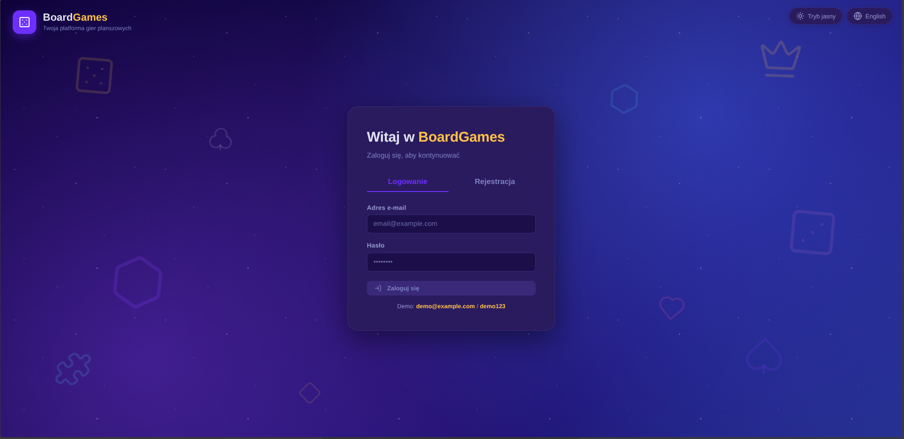
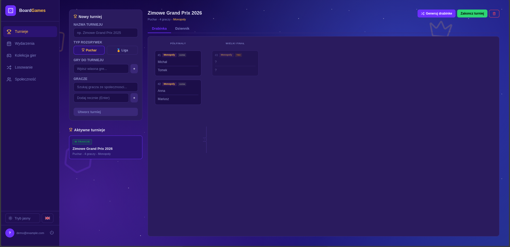
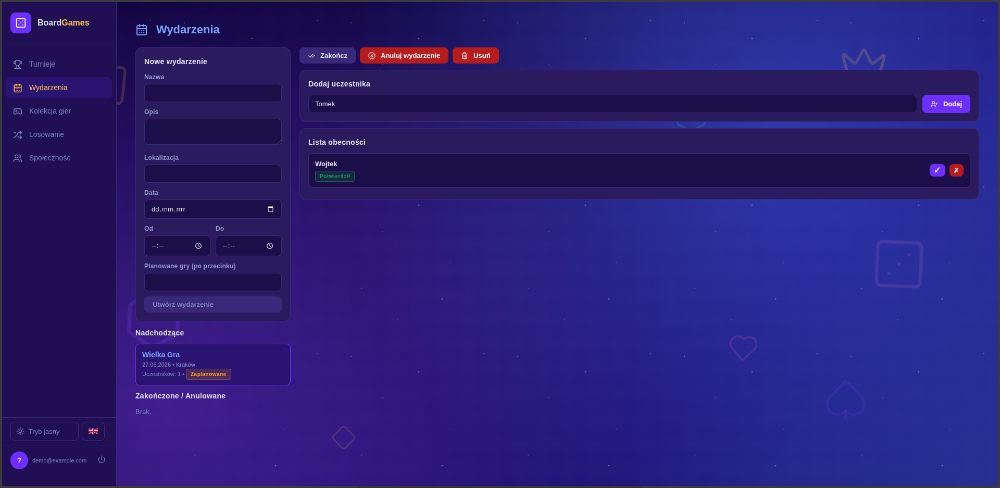
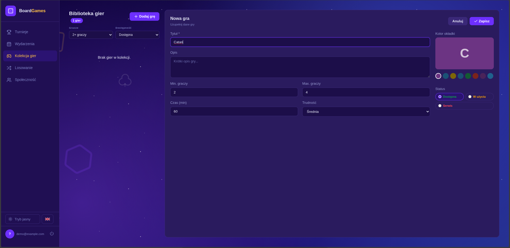
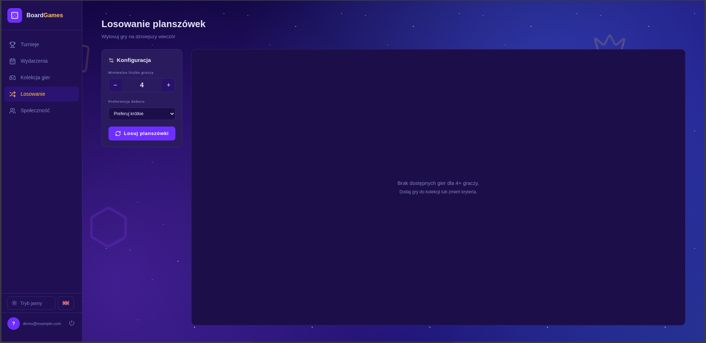
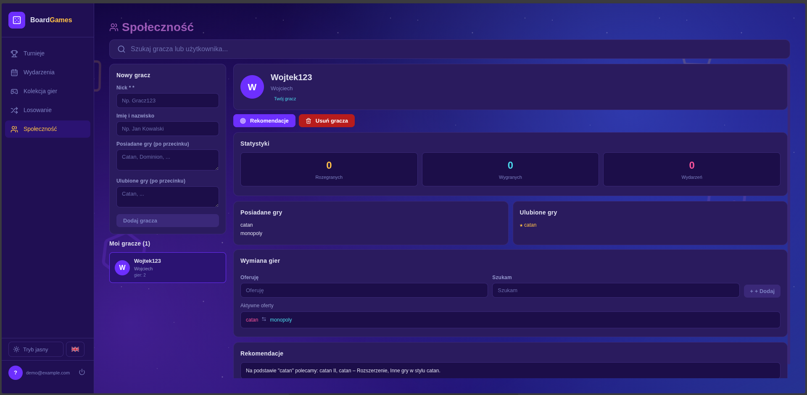
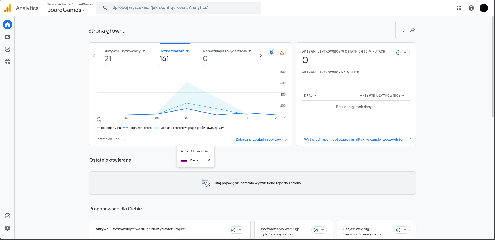
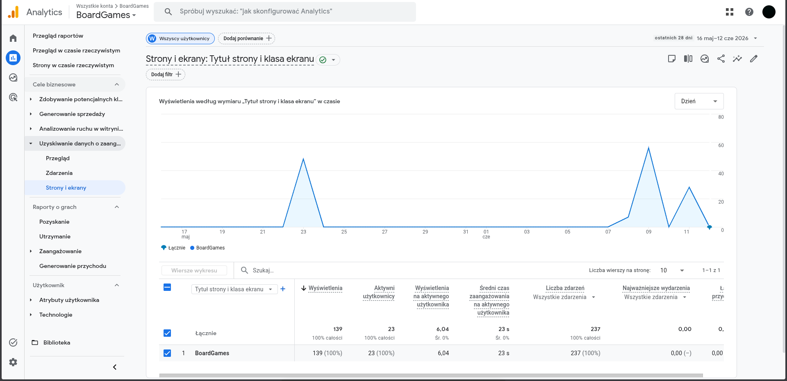
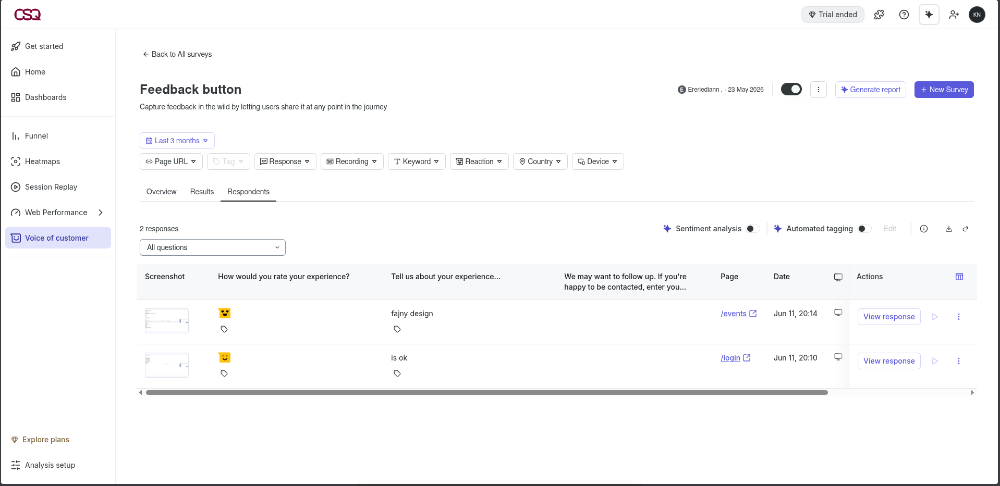

# BoardGames Web App

Aplikacja webowa (SPA) do zarządzania planszówkami: kolekcja gier, losowanie gry na wieczór, turnieje, wydarzenia oraz społeczność graczy. Frontend napisany w React, dane trzymane w pamięci (mock store `src/data/db.js`, odzwierciedlający serwis `Db.I` z oryginalnej aplikacji C#). Interfejs jest dwujęzyczny (PL/EN) i posiada motyw ciemny oraz jasny.

> Status: wersja demonstracyjna 1.0.0 — pełny interfejs działa na danych przykładowych (in-memory), bez backendu i bazy danych. Po odświeżeniu strony dane wracają do stanu początkowego.

## Spis treści

- [Funkcje (co jest zrobione)](#funkcje-co-jest-zrobione)
- [Stos technologiczny](#stos-technologiczny)
- [Wymagania wstępne](#wymagania-wstępne)
- [Instalacja i uruchomienie](#instalacja-i-uruchomienie)
- [Dostępne skrypty / procesy](#dostępne-skrypty--procesy)
- [Konta demo](#konta-demo)
- [Struktura projektu](#struktura-projektu)
- [Routing (ścieżki)](#routing-ścieżki)
- [Architektura i przepływ danych](#architektura-i-przepływ-danych)
- [Motyw i język](#motyw-i-język)
- [Paleta kolorów](#paleta-kolorów)
- [Build produkcyjny i wdrożenie](#build-produkcyjny-i-wdrożenie)
- [Znane ograniczenia / plany](#znane-ograniczenia--plany)

## Funkcje (co jest zrobione)

### Uwierzytelnianie
- Logowanie i rejestracja (`src/pages/LoginPage.jsx`).
- Ochrona tras — niezalogowany użytkownik jest przekierowywany na `/login` (`ProtectedRoute` w `src/App.jsx`).
- Stan zalogowania trzymany w kontekście aplikacji (`AppContext`).

### Kolekcja gier (`/games`)
- Dodawanie, edycja i archiwizacja gier planszowych.
- Atrybuty gry: tytuł, opis, min/max liczba graczy, czas gry (min), złożoność (`Easy` / `Medium` / `Hard`), status (`Available` / `In Use`), kolor okładki.

### Losowanie (`/drawing`)
- Losowanie gry na podstawie liczby graczy oraz wagi/preferencji (`weighting`).
- Potwierdzenie sesji gry.
- Komunikat ostrzegawczy, gdy brak gier dla podanej liczby graczy.

### Turnieje (`/tournaments`)
- Tworzenie turniejów z wieloma graczami i wybranymi grami.
- Typy: `Cup` (drabinka pucharowa) oraz tryb ligowy.
- Tryb rotacyjny (`rotational`) przy wyborze więcej niż jednej gry — gracze rotują, system pilnuje liczby graczy oczekujących.
- Generowanie drabinki, rejestrowanie wyników meczów, tabela wyników i punktacja.
- Zakończenie turnieju z wyłonieniem zwycięzcy oraz zapisem statystyk graczy (rozegrane gry, wygrane turnieje).

### Wydarzenia (`/events`)
- Tworzenie wydarzeń (nazwa, opis, lokalizacja, data, godziny, planowane gry).
- Dodawanie uczestników i zmiana ich statusu.
- Zmiana statusu wydarzenia i usuwanie wydarzeń.

### Społeczność (`/community`)
- Lista graczy z profilami i statystykami (rozegrane gry, wygrane turnieje, udział w wydarzeniach).
- Dodawanie i usuwanie graczy.
- Znajomi: wysyłanie, akceptowanie i odrzucanie zaproszeń.
- Globalne wyszukiwanie użytkowników i graczy.
- Oferty wymiany gier między graczami.

### Funkcje wspólne (UI/UX)
- Motyw ciemny i jasny z zapisem wyboru w `localStorage`.
- Przełącznik języka PL/EN z zapisem w `localStorage`.
- Powiadomienia typu toast (`success` / `error` / `warning` / `info`) z automatycznym znikaniem.
- Responsywny układ z bocznym menu (sidebar) i przyciskiem hamburger na wąskich ekranach.
- Animowane tło nawiązujące do planszówek (`BoardGameBackground`).

## Stos technologiczny

- **React 18** (`react`, `react-dom`)
- **react-router-dom v6** — routing po stronie klienta
- **lucide-react** — zestaw ikon
- **react-scripts (Create React App 5)** — narzędzia dev/build
- **CSS Variables** — motywy i paleta kolorów (zgodne z oryginalną paletą `UIColors.xaml`)

## Wymagania wstępne

- **Node.js 18+**
- **npm** (instalowany razem z Node.js)

## Instalacja i uruchomienie

```bash
# 1. Instalacja zależności
npm install

# 2. Uruchomienie serwera deweloperskiego
npm start
```

Aplikacja będzie dostępna pod adresem `http://localhost:3000`. Serwer deweloperski wspiera hot-reload — zmiany w kodzie są odświeżane automatycznie.

## Dostępne skrypty / procesy

| Komenda | Proces | Opis |
| --- | --- | --- |
| `npm install` | Instalacja | Pobiera zależności do katalogu `node_modules`. |
| `npm start` | Tryb deweloperski | Uruchamia serwer CRA na porcie `3000` z hot-reload. |
| `npm run build` | Build produkcyjny | Tworzy zoptymalizowaną wersję w katalogu `build/`. |

## Konto demo

| Email | Hasło | Wyświetlana nazwa |
| --- | --- | --- |
| `demo@example.com` | `demo123` | Demo User |

Można też utworzyć własne konto przez formularz rejestracji (dane przechowywane w pamięci do czasu odświeżenia strony).

## Struktura projektu

```
.
├── public/                     # Pliki statyczne (index.html, ikony)
├── build/                      # Wynik `npm run build` (generowany)
├── src/
│   ├── App.jsx                 # Definicja tras i ProtectedRoute
│   ├── index.js                # Punkt wejścia React
│   ├── index.css               # Style globalne + zmienne CSS (motywy/paleta)
│   ├── context/
│   │   └── AppContext.jsx       # Globalny stan: user, motyw, język, toasty
│   ├── components/
│   │   ├── Layout.jsx           # Sidebar, nawigacja, toasty, przełączniki
│   │   └── BoardGameBackground.jsx
│   ├── pages/
│   │   ├── LoginPage.jsx        # Logowanie / rejestracja
│   │   ├── GamesPage.jsx        # Kolekcja gier
│   │   ├── DrawingPage.jsx      # Losowanie gry
│   │   ├── TournamentsPage.jsx  # Turnieje
│   │   ├── EventsPage.jsx       # Wydarzenia
│   │   ├── CommunityPage.jsx    # Społeczność
│   │   └── NotFound.jsx
│   └── data/
│       ├── db.js                # Mock in-memory store + funkcje API (async)
│       └── uuid.js              # Generator identyfikatorów
└── package.json
```

## Routing (ścieżki)

| Ścieżka | Strona | Dostęp |
| --- | --- | --- |
| `/login` | Logowanie / rejestracja | Publiczna |
| `/games` | Kolekcja gier | Wymaga logowania |
| `/drawing` | Losowanie | Wymaga logowania |
| `/tournaments` | Turnieje | Wymaga logowania |
| `/events` | Wydarzenia | Wymaga logowania |
| `/community` | Społeczność | Wymaga logowania |

Ścieżka główna `/` przekierowuje na `/games`, a nieznane adresy wracają do strony głównej.

## Architektura i przepływ danych

- **Warstwa danych:** `src/data/db.js` to mock przechowujący dane w pamięci (`users`, `boardGames`, `tournaments`, `events`, `players`, `friends`, `friendRequests`, `exchanges`). Funkcje są asynchroniczne (`async`) i symulują opóźnienie sieciowe, co ułatwia ewentualne podpięcie prawdziwego API.
- **Stan globalny:** `src/context/AppContext.jsx` udostępnia przez React Context: zalogowanego użytkownika (`login`/`logout`), motyw (`theme`/`toggleTheme`), język (`language`/`toggleLanguage`) oraz powiadomienia (`addToast`/`toasts`/`removeToast`).
- **Trwałość:** wybór motywu i języka jest zapisywany w `localStorage`; pozostałe dane są ulotne (znikają po odświeżeniu).

## Motyw i język

- **Motyw:** ciemny (domyślny) oraz jasny, przełączane ikoną w sidebarze. Atrybut `data-theme` na elemencie `<html>` decyduje o aktywnym zestawie zmiennych CSS.
- **Język:** polski (domyślny) oraz angielski, przełączane ikoną globusa. Atrybut `data-lang` ustawiany jest na `<html>`.

## Paleta kolorów

Kolory zdefiniowane są jako zmienne CSS w `src/index.css` (zgodne z oryginalną paletą `UIColors.xaml`).

### Motyw ciemny (domyślny)

| Zmienna | Wartość | Zastosowanie |
| --- | --- | --- |
| `--body-bg` | `#07002A` | Tło aplikacji |
| `--primary-bg1` | `#0A003A` | Tło podstawowe |
| `--primary-bg2` | `#1C0E49` | Tło podstawowe (wariant) |
| `--card-bg` | `#2A1B5E` | Tło kart |
| `--border-color` | `#3A2878` | Obramowania |
| `--purple` | `#6D2FFF` | Akcent główny (fioletowy) |
| `--purple-hover` | `#7E3AF2` | Akcent — hover |
| `--color6` | `#FFC047` | Złoty (akcent / logo) |
| `--color3` | `#4ADAEC` | Cyan |
| `--color4` | `#FB539B` | Różowy |
| `--color9` | `#07F3C0` | Zielony / miętowy |
| `--color14` | `#E14D3D` | Czerwony (błędy) |
| `--title1` | `#E0E1F1` | Tekst nagłówków |
| `--text1` | `#9497CD` | Tekst pomocniczy |

### Motyw jasny

| Zmienna | Wartość | Zastosowanie |
| --- | --- | --- |
| `--body-bg` | `#F0ECFF` | Tło aplikacji |
| `--card-bg` | `#FFFFFF` | Tło kart |
| `--border-color` | `#C4B8F0` | Obramowania |
| `--purple` | `#5B21B6` | Akcent główny |
| `--title1` | `#1E1245` | Tekst nagłówków |
| `--text1` | `#4B3FA0` | Tekst pomocniczy |

> Pełny zestaw zmiennych (`--color1`…`--color14`, `--title*`, `--text*`, `--panel-*` itd.) znajduje się w `src/index.css`.

## Build produkcyjny i wdrożenie

```bash
npm run build
```

Polecenie tworzy zoptymalizowaną, statyczną wersję aplikacji w katalogu `build/`. Zawartość tego katalogu można udostępnić przez dowolny serwer plików statycznych (np. Nginx, Apache, GitHub Pages, Azure Static Web Apps). Ponieważ aplikacja korzysta z routingu po stronie klienta, serwer powinien kierować nieznane ścieżki do `index.html` (fallback SPA).

## Znane ograniczenia / plany

- Brak backendu i trwałej bazy danych — dane są przechowywane w pamięci i resetowane przy odświeżeniu strony.
- Hasła w danych demo są jawne (`passwordHash` to wartość przykładowa) — wyłącznie do celów demonstracyjnych.
- Naturalny kierunek rozwoju: podpięcie realnego API w miejsce funkcji z `src/data/db.js` (zachowany już asynchroniczny interfejs).

## Screeny aplikacji, Contentsquare i Google Analytics

### Aplikacja BoardGames


<p align=center>Strona logowania</p>


<p align=center>Strona turniejów</p>


<p align=center>Strona wydarzeń</p>


<p align=center>Strona kolekcji gier</p>


<p align=center>Strona losowania gier</p>


<p align=center>Strona społeczności</p>

### Google Analytics i Contentsquare


<p align=center>Google Analytics - strona główna</p>


<p align=center>Google Analytics - rejestr zdarzeń</p>


<p align=center>ContentSquare - wyniki ankiety użytkowników</p>


